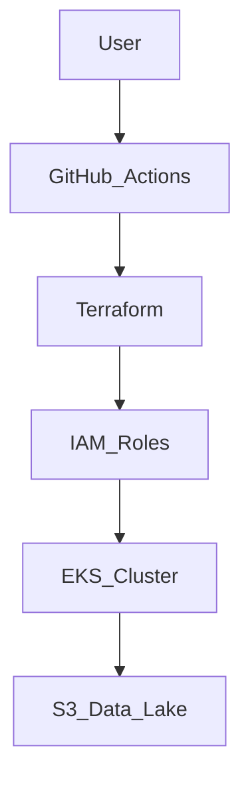

Project Aegis: AI-Ready Governance Framework
Project Aegis is a Governance-as-Code (GaC) framework designed to automate the security, compliance, and fiscal management of global infrastructure fleets.

Key Architecture Update (2026): MLOps Secure Landing Zone
As a Google Professional Cloud Architect, I have expanded Aegis to include a modular architecture for AI/ML workloads. This allows for the rapid deployment of research environments that are secure by default.

Secure-by-Design Data Lakes: Automated provisioning of encrypted GCS/S3 buckets with public-access prevention enforced at the root, ensuring NIST 800-53 and FERPA compliance.

Modular FinOps Telemetry: Integrated compute-usage export hooks that provide real-time visibility into GPU expenditure, preventing "zombie" instance costs in high-compute AI clusters.

Scalable Infrastructure: Utilizing a parent-child module relationship, Aegis can scale from single-department research nodes to enterprise-wide ML pipelines without manual intervention.

Project Aegis: Multi-Cloud Identity & Automated Governance
🎯 Executive Summary
Project Aegis is a Compliance-as-Code framework designed to automate security and identity governance across AWS and Azure. It ensures infrastructure is audit-ready for SOC2 Type II and NIST 800-53.

🏗 Technical Architecture
This project implements a "Defense-in-Depth" strategy:

Network: Uses an AWS VPC with Private Subnets.

Identity: Connects Okta to AWS IAM using OIDC.

Automation: A Python-based engine scans for misconfigurations.

📊 System Flow

